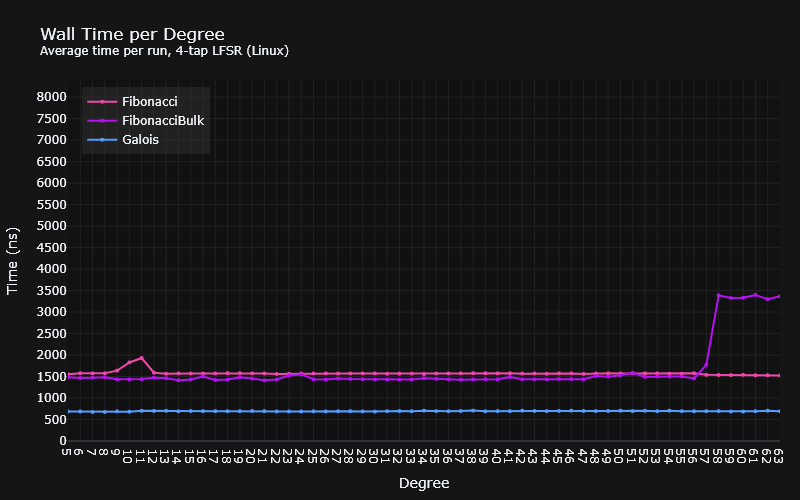
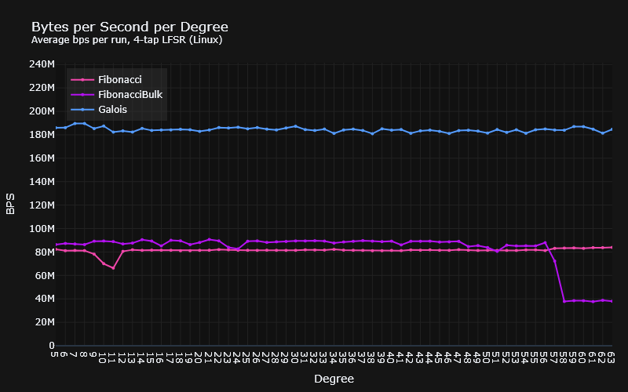
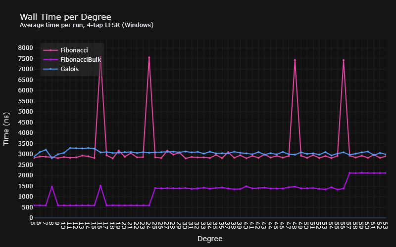
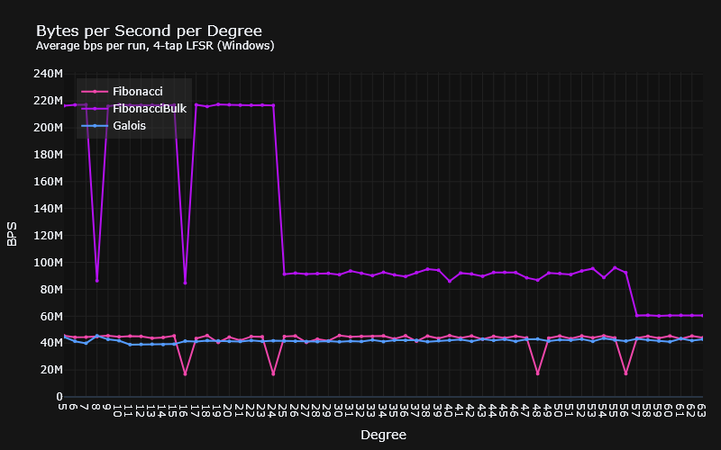

# Scrambling LFSRs

This repository implements scrambling linear feedback shift registers in C++.
There are three implementations:

* Fibonacci (bit at a time)
* Fibonacci (byte at a time)
* Galois (bit at a time)

They are templated via the LFSRs taps. The reason for using templates is to give
the compiler every opportunity to optimise the various bit-level operations that
are required, i.e., shifts, XORs, ANDs etc.

There are three executables included:

* `test_lfsr.cpp`: This tests instantiations of every polynomial listed on the
  wikipedia page for the following:
  * That each LFSR is maximal length by continually clocking in zeroes and
    testing that the state resets as expected every $2^{degree} - 1$ iterations;
  * That the scrambled output does not equal it's input at any stage. Note that
    this is not a guarantee that this won't happen; I believe it is possible for
    a pathological series of inputs to cause the output byte to equal the input
  * And finally, that the output of a scrambled and then descrambled byte 
    equals the input byte.
* `bench_lfsr.cpp`: Using Google Benchmark, benchmark the following for each 
  type ofLFSR:
  * Individual scramble byte operations
  * Scrambling a range of values
* `tune_lfsr.cpp`: Contains and runs an instantiation of each LFSR type, writing
  the output to a file. This is mainly for profiling using Intel VTune or 
  `callgrind`/`kcachegrind` as doing so on either the benchmarks or tests produces
  a lot of call stack noise.

Both the bit at a time Galois and Fibonacci LFSRs are written in the usual way,
save for the template madness.
* Fibonacci's input is on the right (LSB) of the shift register, and shifted to
  the left;
* Galois' input is on the left (MSB) of the shift register and shifted to the
  right.

The "bulk" Fibonacci is written differently, in
a manner I haven't personally seen done elsewhere, but is probably obvious to
folks who have dealt with this sort of thing before, particularly those who are
into their mathematics.

* Since the scramble calculation involves XORing the input with the bits in the
  shift register at the various tap positions, this can instead be done by:
  * including the input bits into the register, as opposed to separately, as per
    literature;
  * Getting the "population count" (the number of bits set) of the 
    combined register state `AND` a mask representing the tap positions. This 
    result $mod2$ is equivalent to XORing them all together as one would do.
* Where an input bit has a dependency on another input bit (in the input byte),
  the dependencies can be merged into a new dependency (tap) mask, making each
  operation independent.

As an illustrative example, we can take relatively small LFSR with taps at 
5 & 6 (being fancy, this would be polynomial $x^6 + x^5 + 1$), and visualise in 
a table how the tap masks end up looking.

* The $In_{n}$ columns represent the part of the shift register dedicated to 
  input.
* The $B_{n}$ columns represent the part of the shift register that keeps state.

Each row represents a mask of taps that can be `AND`ed with the shift register
to accumulate the bit values at the respective tap positions.

Naively, we might think we could do the XOR + popcount by sliding the tap mask
back 1 bit for each bit, however the bits at $5$, $6$, and $7$ depend upon the
value of what would ordinarily have been a previously calculated and scrambled
bit. The problematic taps are coloured red, and the "cascaded" dependencies are
coloured cyan.

> **Note**: Since the input is being shifted left to right (MSB to LSB) in a
> `std::bitset`, the tap indexes are reversed and 0-indexed. Therefore the tap
>  indexes for this polynomial become:
> 
> | Tap   | Index |
> |-------|-------|
> | $x^6$ | `0`   |
> | $x^5$ | `1`   |
> | $1$   | `6`   |

|                  | $In_{7}$ | $In_{6}$ | $In_{5}$ | $In_{4}$ |      $In_{3}$ |          $In_{2}$ |          $In_{1}$ |          $In_{0}$ | $B_{5}$ | $B_{4}$ |           $B_{3}$ |           $B_{2}$ |           $B_{1}$ |           $B_{0}$ |
|------------------|----------|----------|----------|----------|---------------|-------------------|-------------------|-------------------|---------|---------|-------------------|-------------------|-------------------|-------------------|
| Taps for bit $0$ |      $0$ |      $0$ |      $0$ |      $0$ |           $0$ |               $0$ |               $0$ | $\color{cyan}{1}$ |     $0$ |     $0$ |               $0$ |               $0$ | $\color{cyan}{1}$ | $\color{cyan}{1}$ |
| Taps for bit $1$ |      $0$ |      $0$ |      $0$ |      $0$ |           $0$ |               $0$ | $\color{cyan}{1}$ |               $0$ |     $0$ |     $0$ |               $0$ | $\color{cyan}{1}$ | $\color{cyan}{1}$ |               $0$ |
| Taps for bit $2$ |      $0$ |      $0$ |      $0$ |      $0$ |           $0$ | $\color{cyan}{1}$ |               $0$ |               $0$ |     $0$ |     $0$ | $\color{cyan}{1}$ | $\color{cyan}{1}$ |               $0$ |               $0$ |
| Taps for bit $3$ |      $0$ |      $0$ |      $0$ |      $0$ |           $1$ |               $0$ |               $0$ |               $0$ |     $0$ |     $1$ |               $1$ |               $0$ |               $0$ |               $0$ |
| Taps for bit $4$ |      $0$ |      $0$ |      $0$ |      $1$ |           $0$ |               $0$ |               $0$ |               $0$ |     $1$ |     $1$ |               $0$ |               $0$ |               $0$ |               $0$ |
| Taps for bit $5$ |      $0$ |      $0$ |      $1$ |      $0$ |           $0$ |               $0$ |               $0$ |  $\color{red}{1}$ |     $1$ |     $0$ |               $0$ |               $0$ |               $0$ |               $0$ |
| Taps for bit $6$ |      $0$ |      $1$ |      $0$ |      $0$ |           $0$ |               $0$ |  $\color{red}{1}$ |  $\color{red}{1}$ |     $0$ |     $0$ |               $0$ |               $0$ |               $0$ |               $0$ |
| Taps for bit $7$ |      $1$ |      $0$ |      $0$ |      $0$ |           $0$ |  $\color{red}{1}$ |  $\color{red}{1}$ |               $0$ |     $0$ |     $0$ |               $0$ |               $0$ |               $0$ |               $0$ |

However, this can be solved by accumulating the dependencies for each dependee
in the input, XORing them together, producing a set of mask that look like this:

|                  | $In_{7}$ | $In_{6}$ | $In_{5}$ | $In_{4}$ |      $In_{3}$ |          $In_{2}$ |          $In_{1}$ |          $In_{0}$ | $B_{5}$ | $B_{4}$ |           $B_{3}$ |           $B_{2}$ |           $B_{1}$ |           $B_{0}$ |
|------------------|-------------------|-------------------|-------------------|-------------------|-------------------|-------------------|-------------------|-------------------|-------------------|-------------------|-------------------|-------------------|-------------------|-------------------|
| Taps for bit $0$ |               $0$ |               $0$ |               $0$ |               $0$ |               $0$ |               $0$ |               $0$ | $\color{cyan}{1}$ |               $0$ |               $0$ |               $0$ |               $0$ | $\color{cyan}{1}$ | $\color{cyan}{1}$ |
| Taps for bit $1$ |               $0$ |               $0$ |               $0$ |               $0$ |               $0$ |               $0$ | $\color{cyan}{1}$ |               $0$ |               $0$ |               $0$ |               $0$ | $\color{cyan}{1}$ | $\color{cyan}{1}$ |               $0$ |
| Taps for bit $2$ |               $0$ |               $0$ |               $0$ |               $0$ |               $0$ | $\color{cyan}{1}$ |               $0$ |               $0$ |               $0$ |               $0$ | $\color{cyan}{1}$ | $\color{cyan}{1}$ |               $0$ |               $0$ |
| Taps for bit $3$ |               $0$ |               $0$ |               $0$ |               $0$ | $\color{cyan}{1}$ |               $0$ |               $0$ |               $0$ |               $0$ | $\color{cyan}{1}$ | $\color{cyan}{1}$ |               $0$ |               $0$ |               $0$ |
| Taps for bit $4$ |               $0$ |               $0$ |               $0$ | $\color{cyan}{1}$ |               $0$ |               $0$ |               $0$ |               $0$ | $\color{cyan}{1}$ | $\color{cyan}{1}$ |               $0$ |               $0$ |               $0$ |               $0$ |
| Taps for bit $5$ |               $0$ |               $0$ | $\color{cyan}{1}$ |               $0$ |               $0$ |               $0$ |               $0$ | $\color{cyan}{1}$ | $\color{cyan}{1}$ |               $0$ |               $0$ |               $0$ | $\color{lightgreen}{1}$ | $\color{lightgreen}{1}$ |
| Taps for bit $6$ |               $0$ | $\color{cyan}{1}$ |               $0$ |               $0$ |               $0$ |               $0$ | $\color{cyan}{1}$ | $\color{cyan}{1}$ |               $0$ |               $0$ |               $0$ | $\color{lightgreen}{1}$ |               $0$ | $\color{lightgreen}{1}$ |
| Taps for bit $7$ | $\color{cyan}{1}$ |               $0$ |               $0$ |               $0$ |               $0$ | $\color{cyan}{1}$ | $\color{cyan}{1}$ |               $0$ |               $0$ |               $0$ | $\color{lightgreen}{1}$ |               $0$ | $\color{lightgreen}{1}$ |                 0 |

Note that the zeroes occur in the updated matrix when a dependee occurs
$mod2$. If a bit is XORed twice (or by some factor of 2) , it is cancelled out
and doesn't contribute to the final result.

## Performance

Performance was benchmarked using instantiations for the following polynomial:
$x^{12} + x^{11} + x^{10} + x^4 + 1$ (i.e., with taps at 4, 10, 11, 12). This 
choice was arbitrary, other than being in the middle of the pack of the polys 
listed on Wikipedia. Other instantiations may produce different results.

According to Google Benchmark, there are substantially different results across
MSVC and GCC. On Linux, GCC produces significantly faster bit-by-bit LFSRs than
MSVC, with the Galois version being the fastest, and the bulk Fibonacci
disappointingly sitting somewhere in the middle. On Windows, however, the bulk
Fibonacci version blows everybody out of the water with a figure that is faster
than any of the Linux implementations. The disappointment here lies in the 
bit-by-bit versions, which are considerably slower than their Linux 
counterparts.

### Linux (WSL2 + GCC)

### Windows (MSVC)

